# Java项目详细设计说明书（最终版）

| 文档标识       | DRPlatform-DDD-V2.0      | 版本       | 2.0        |
|:---------- |:----------------------- |:-------- |:---------- |
| **项目名称**   | 地理数据库灾备同步服务 (DRPlatform) | **密级**   | 内部公开       |
| **子系统/模块** | 数据同步核心模块                | **作者**   | [50707]    |
| **评审人**    | [技术负责人、安全负责人、架构师]       | **发布日期** | 2026-07-18 |

---

## 1. 引言

### 1.1 文档目的

本文档是DRPlatform（地理数据库灾备同步服务）的最终详细设计说明书，旨在完整、无遗漏地描述系统的内部架构、核心类设计、关键算法、数据模型、异常处理、安全策略及非功能性实现，作为后续重新实现、代码评审、测试及运维的唯一依据。

### 1.2 适用范围

适用于Java后端服务、Flink流式计算应用、云原生环境下的数据库灾备同步项目。

### 1.3 设计约束与遵循规范

- **技术栈约束**：Java 17、Spring Boot 3.x、Apache Flink 1.18、MyBatis-Plus、MariaDB/MySQL、RocketMQ（可选）。
- **设计原则**：遵循SOLID、高内聚低耦合、开闭原则。
- **外部规范**：
  - 华为《Java编码规范（2026版）》
  - 阿里巴巴《Java开发手册（嵩山版）》及2026补充
  - 《信息通信产品运行安全完整性总体要求》（T/TAF 331.1—2026）

### 1.4 术语与缩略语

| 术语            | 说明                                 |
|:------------- |:---------------------------------- |
| **生产中心**      | 业务运行的主数据库环境。                       |
| **灾备中心**      | 数据同步的目标数据库环境，用于容灾备份。               |
| **DDL**       | 数据库定义语言，如 CREATE、ALTER、DROP TABLE。 |
| **DML**       | 数据库操作语言，如 INSERT、UPDATE、DELETE。    |
| **CDC**       | 变更数据捕获，用于监听数据库变化。                  |
| **Binlog**    | MySQL的二进制日志，记录了所有数据库变更。            |
| **Savepoint** | Flink作业的状态快照，用于作业重启和故障恢复。          |
| **WAL**       | 预写日志，此处指在Flink算子状态中持久化未确认的批次数据。    |

---

## 2. 总体设计

### 2.1 模块定位与边界

- **模块定位**：负责将生产中心数据库的增量数据（CDC）实时同步到灾备中心数据库，确保数据最终一致性，并提供主备切换后的平滑恢复能力。
- **边界划分**：
  - **对外提供**：REST API（同步进度查询、手动重启）。
  - **依赖外部**：源数据库（生产中心）、目标数据库（灾备中心）、Flink集群、配置中心。
- **依赖关系**：本模块依赖Flink运行时环境、数据库连接池、元数据库和配置文件。

### 2.2 技术架构选型

| 组件    | 选型                   | 版本     | 选型理由                           |
|:----- |:-------------------- |:------ |:------------------------------ |
| 基础框架  | Spring Boot          | 3.2.x  | 生态完善，方便集成REST API。             |
| 流处理引擎 | Apache Flink         | 1.18.x | 强大的状态管理和Exactly-Once语义，适合实时同步。 |
| 持久层   | MyBatis-Plus         | 3.5.x  | 简化CRUD，用于元数据管理。                |
| 数据库   | MariaDB/MySQL        | 8.x    | 与生产中心数据库兼容。                    |
| 配置管理  | Nacos (可选)           | 2.3.x  | 动态配置更新。                        |
| 监控    | Prometheus + Grafana | -      | 云原生可观测性标准。                     |

### 2.3 模块整体架构图

#### 2.3.1 总体业务简介

DRPlatform服务是一个基于Flink的数据库实时同步平台，用于将生产中心（主库）的变更数据实时同步至灾备中心（备库），保障业务数据在灾难发生时能够快速恢复。系统通过监听生产中心数据库的Binlog日志，捕获数据变更（INSERT/UPDATE/DELETE），并将这些变更以批量的形式写入灾备中心，同时支持DDL变更的同步和主备切换后的平滑恢复。服务本身采用微服务架构，通过REST API提供状态查询和手动干预能力。

#### 2.3.2 总体架构图

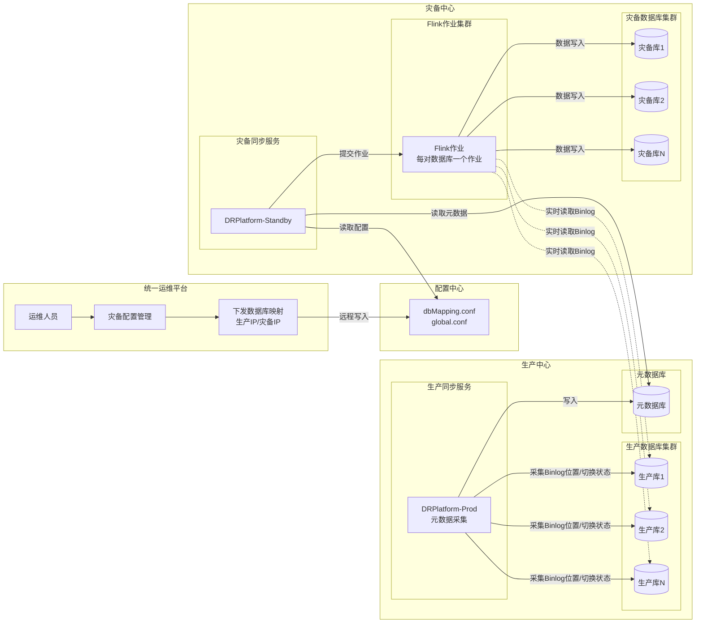

**架构说明**：

- **统一运维平台**：运维人员配置生产-灾备数据库映射，并通过接口将配置下发至灾备中心。
- **配置中心**：存储`dbMapping.conf`等配置文件，供生产同步服务和灾备同步服务读取。
- **生产中心**：
  - **生产同步服务**：定时采集各生产库的最新Binlog位置和主备切换状态，写入元数据库。
  - **元数据库**：集中存储所有生产库的Binlog位置和切换状态，供灾备中心使用。
- **灾备中心**：
  - **灾备同步服务**：读取配置，为每对数据库映射创建并提交独立的Flink作业；从元数据库获取断点信息。
  - **Flink作业集群**：每个作业直接连接生产库，实时读取Binlog变更，写入对应的灾备库，实现多对数据库并行同步。
- **数据流**：实线表示配置/元数据流，虚线表示Binlog数据流。灾备中心负责所有数据同步工作，生产中心仅辅助元数据采集。

#### 2.3.3 部署架构图

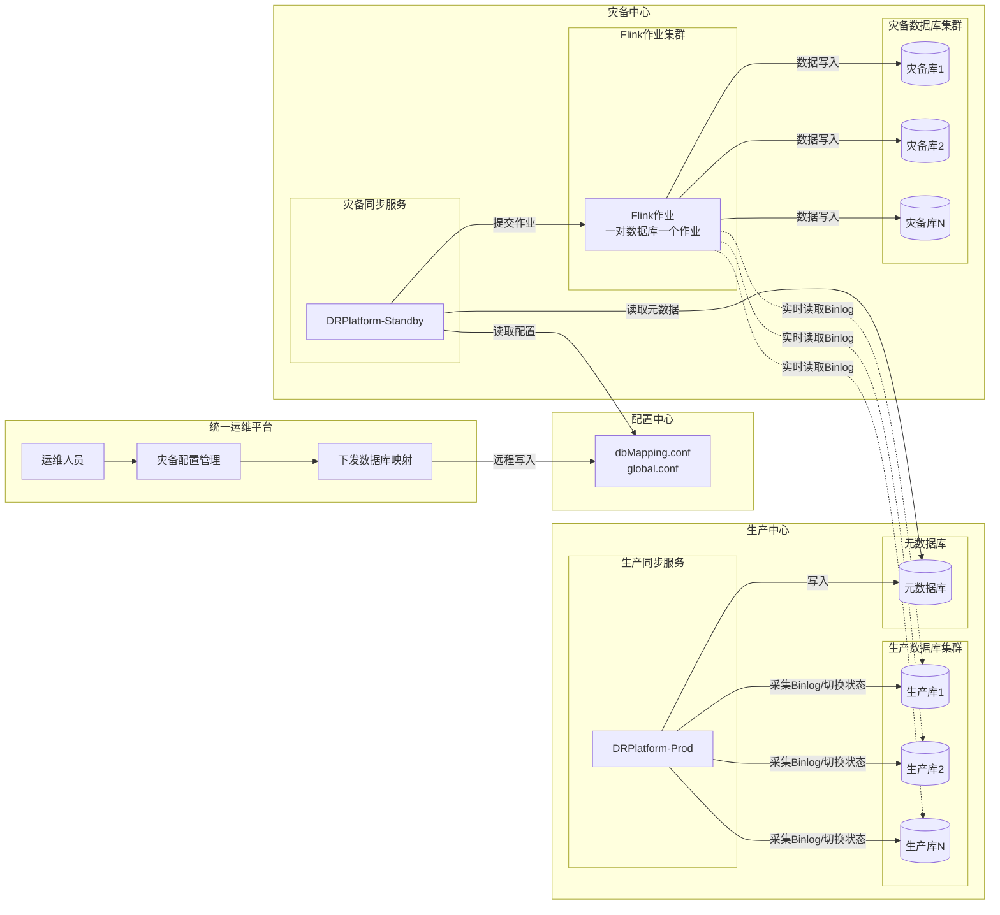

**部署说明**：

- 生产中心和灾备中心各部署一套DRPlatform服务，分别承担元数据采集和数据同步职责。
- Flink作业运行在独立的集群上，可水平扩展。
- 元数据库采用MySQL，存储同步进度、主备切换状态和Binlog位置。
- 配置中心使用本地文件，支持动态更新（需重启服务）。

---

## 3. 模块详细设计

### 3.1 分层结构

| 层级        | 包名示例                     | 职责                                                          |
|:--------- |:------------------------ |:----------------------------------------------------------- |
| **接口层**   | `*.controller`           | REST API、DTO转换、参数校验、鉴权。                                     |
| **应用层**   | `*.service`, `*.manager` | 同步任务管理、进度持久化、主备切换监控。                                        |
| **领域层**   | `*.sink`, `*.custom`     | Flink算子（`DataBaseSinkFunction`, `TableSinkFunction`）、DDL处理。 |
| **基础设施层** | `*.utils`, `*.config`    | 数据库连接管理、配置加载、脚本执行、Flink环境构建。                                |

### 3.2 核心类设计

#### 3.2.1 类图（UML）

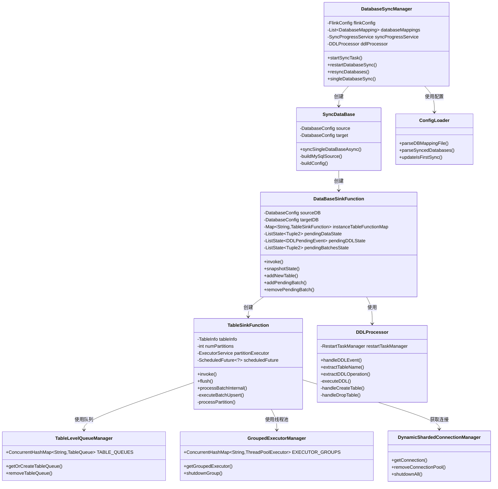

**类关系说明**：

- `DatabaseSyncManager`是入口管理器，负责启动、停止、重启同步任务。
- `SyncDataBase`为单个数据库构建Flink作业，内部创建`DataBaseSinkFunction`。
- `DataBaseSinkFunction`是Flink Sink算子，管理一个数据库下所有表的写入，并处理DDL事件。
- `TableSinkFunction`是表级Sink，负责具体数据的批量写入，使用`TableLevelQueueManager`管理分区队列，使用`GroupedExecutorManager`进行线程池调度，使用`DynamicShardedConnectionManager`获取数据库连接。
- `DDLProcessor`处理DDL事件，动态创建/修改表算子。
- `ConfigLoader`负责所有配置文件的加载与解析。

#### 3.2.2 关键类职责表

| 类名                                | 所属层   | 职责                                 | 关键方法                                                            |
|:--------------------------------- |:----- |:---------------------------------- |:--------------------------------------------------------------- |
| `DatabaseSyncManager`             | 应用层   | 同步服务总控，负责启动/停止/重启同步任务。             | `startSyncTask()`, `restartDatabaseSync()`, `resyncDatabases()` |
| `SyncDataBase`                    | 领域层   | 为单个数据库构建并提交Flink作业。                | `syncSingleDataBaseAsync()`, `buildMySqlSource()`               |
| `DataBaseSinkFunction`            | 领域层   | Flink Sink算子，管理所有表的写入，处理DDL，支持WAL。 | `invoke()`, `snapshotState()`, `addNewTable()`                  |
| `TableSinkFunction`               | 领域层   | 表级Sink算子，负责具体数据的批量写入和分区管理。         | `invoke()`, `processBatchInternal()`, `flush()`                 |
| `DDLProcessor`                    | 领域层   | 解析和执行DDL语句，动态创建/更新表算子。             | `handleDDLEvent()`, `executeDDL()`                              |
| `ConfigLoader`                    | 基础设施层 | 解析`.conf`配置文件，加载数据库映射、VIP映射等。      | `parseDBMappingFile()`, `parseSyncedDatabases()`                |
| `DynamicShardedConnectionManager` | 基础设施层 | 管理到目标库的连接池，实现全局连接控制。               | `getConnection()`, `shutdownAll()`                              |

### 3.3 核心流程时序图

#### 3.3.1 构建灾备主入口（Shell脚本 + Java）

**场景描述**：运维人员在统一运维平台触发灾备构建操作，平台调用远程脚本`setDRInfo`，该脚本负责将配置参数传递给灾备中心的DRPlatform服务，触发同步作业的启动。

**时序图**：

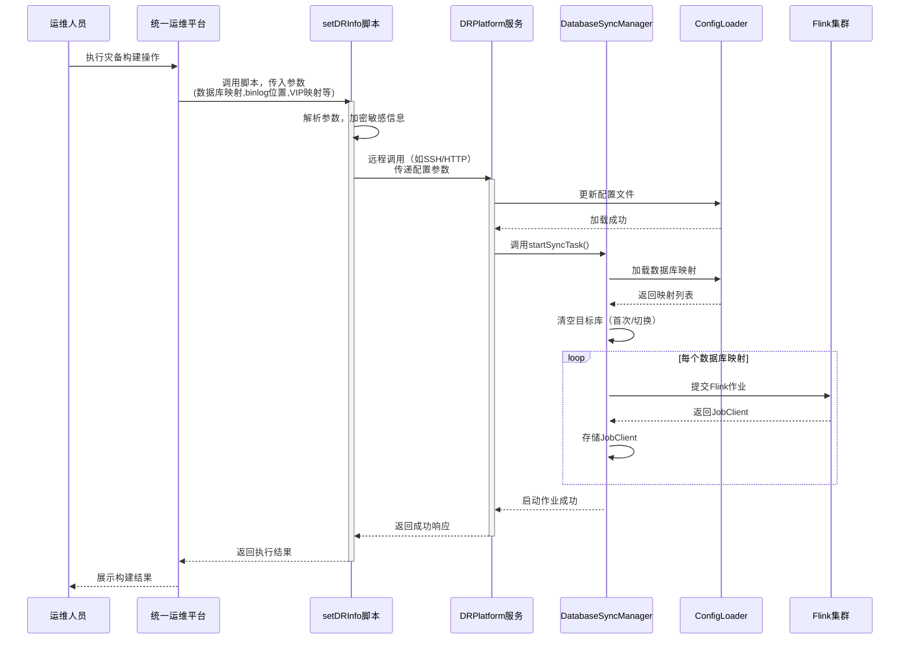

**业务说明**：

1. **触发构建**：运维人员在统一运维平台选择“构建灾备”，平台后台调用`setDRInfo`脚本，并传入必要的参数（数据库映射、VIP映射、binlog位置等）。
2. **脚本处理**：
   - 脚本解析传入的参数，将敏感信息（如数据库密码）使用配置的`encrypted_Psenstive_xxx`加密。
   - 脚本通过SSH或HTTP方式远程调用灾备中心DRPlatform服务的特定接口（如`/api/admin/setup`），将配置参数发送过去。
3. **服务端处理**：
   - DRPlatform服务接收到请求后，将配置参数写入配置文件（如`dbMapping.conf`、`global.conf`）。
   - 调用`DatabaseSyncManager.startSyncTask()`，启动同步服务。
   - `startSyncTask()`根据配置加载映射、清理目标库、提交Flink作业。
4. **结果返回**：同步作业启动成功后，返回结果给运维平台，运维人员可见构建状态。

#### 3.3.2 同步任务启动流程

**流程图**：

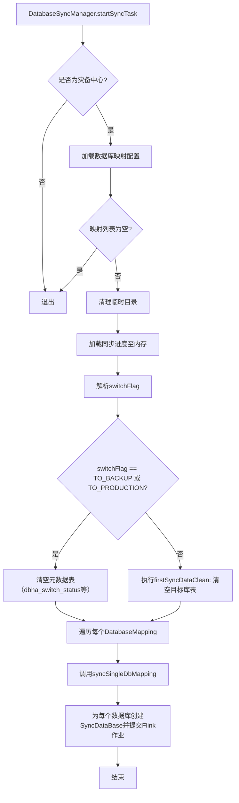

**文字说明**：

1. **灾备模式检查**：`DatabaseSyncManager.startSyncTask`首先判断当前服务是否以灾备中心模式运行（`isStandbyMode`），若不是则直接退出，避免误操作。
2. **配置加载**：从`dbMapping.conf`解析数据库映射关系，包括源库、目标库的IP、端口、用户名、密码、数据库类型等。
3. **数据清理**：
   - 若`switchFlag`为`TO_BACKUP`（生产切灾备）或`TO_PRODUCTION`（灾备切生产），表示正在进行主备切换，需要清空元数据表（如`dbha_switch_status`、`source_latest_binlog_info`等），确保切换后从新的生产中心重新记录信息。
   - 否则，为首次同步，调用`firstSyncDataClean`，根据配置的`syncedDatabases`判断哪些数据库是第一次同步，然后清空这些库在目标库中的所有表数据（排除忽略表）。
4. **启动作业**：遍历每个`DatabaseMapping`，为每个源数据库创建`SyncDataBase`实例，调用`syncSingleDbMapping`异步提交Flink作业。
5. **作业提交**：`SyncDataBase`内部构建Flink源（MySQL CDC）、Sink算子（`DataBaseSinkFunction`），配置Checkpoint和Savepoint路径，最后调用`env.executeAsync`提交作业，并将返回的`JobClient`存入`DatabaseSyncManager.JOB_CLIENTS`中。

### 3.4 状态机设计

#### 3.4.1 同步状态变迁图

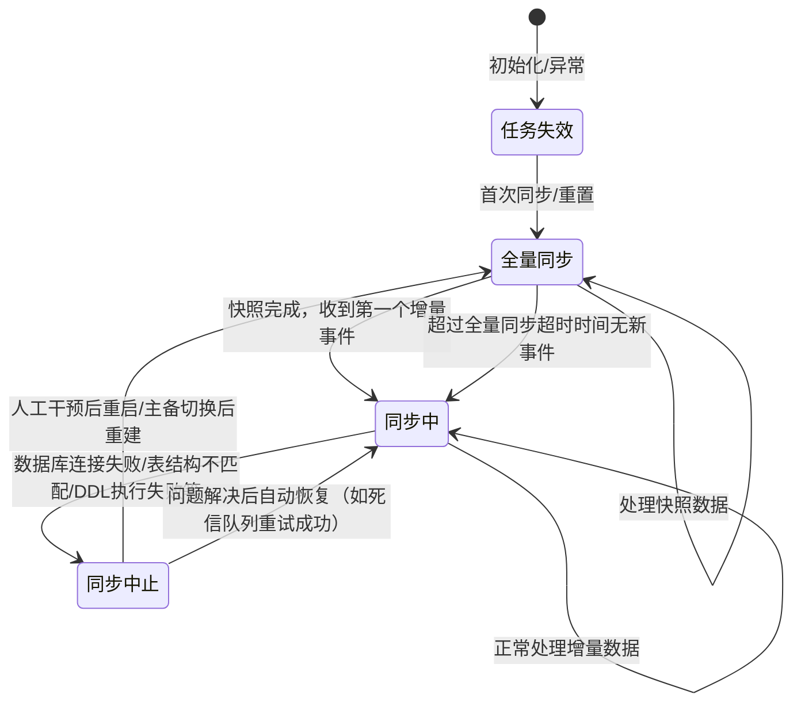

**状态说明**：

- **任务失效 (INVALID)**：初始状态或任务被标记为失效，不再同步。
- **全量同步 (FULL_SYNC)**：正在执行全量快照同步。该状态由收到第一个`r`(read)事件触发。若长时间无事件（由`fullAutoToIncremental`配置），自动切换到`SYNCING`。
- **同步中 (SYNCING)**：增量同步状态，处理DML/DDL事件。
- **同步中止 (SUSPENDED)**：发生不可恢复错误（如数据库连接失败、表结构不匹配、DDL执行失败且重试无果），同步暂停，需要人工介入或主备切换重建。

**状态转换规则**：

- 任务失效 -> 全量同步：在`DatabaseSyncManager`启动或重启任务时，若首次同步或完全重置，将状态设为`FULL_SYNC`。
- 全量同步 -> 同步中：收到非`r`事件（DML/DDL），或超过`fullAutoToIncremental`秒无事件。
- 同步中 -> 同步中止：在`DataBaseSinkFunction`或`TableSinkFunction`中遇到无法处理的异常（如数据库连接失败、表结构不匹配），通过`addToAbnormalSyncProgressList`将状态设为`SUSPENDED`。
- 同步中止 -> 全量同步：主备切换后重建任务，或通过REST API手动重启，会触发全量同步。
- 同步中止 -> 同步中：如果死信队列中的事件被成功重试，状态可以恢复为`SYNCING`，但当前实现中，死信队列重试成功后不会自动修改进度状态，可能需要进一步优化。

### 3.5 关键算法与业务规则

| 算法/规则         | 输入               | 输出            | 算法描述                                                                                                         | 复杂度            |
|:------------- |:---------------- |:------------- |:------------------------------------------------------------------------------------------------------------ |:-------------- |
| **数据库连接池管理**  | `DatabaseConfig` | `Connection`  | 使用`DynamicShardedConnectionManager`，基于IP、数据库名、用户名创建HikariCP连接池，并通过全局信号量控制最大连接数，防止数据库连接数超限。                   | O(1)           |
| **WAL批次重试机制** | 处理失败的批次          | 成功处理/降级单条处理   | 每个取出的批次数据先存入Flink状态（`pendingBatchesState`），处理失败后重试，超过`MAX_WAL_RETRIES`后降级为单条处理，单条再失败则进入死信队列。                 | O(n)           |
| **分区键计算**     | `JSONObject`事件   | `Integer`分区索引 | 优先使用表的主键作为分区键，保证同一行数据进入同一分区。若无主键，则随机分区。                                                                      | O(m) (m为分区键列数) |
| **动态批次大小调整**  | `TableQueue`处理速度 | `int`动态批次大小   | 根据每秒处理速率(`processTps`)动态调整`commitBatchSize`。若`tps < 100`，批次大小减半（最小1000）；若`tps > 5000`，批次大小恢复至`maxQueueSize`。 | O(1)           |

### 3.6 异常恢复流程（DatabaseSinkFunction与TableSinkFunction中的定时任务）

#### 3.6.1 异常恢复总体说明

`DataBaseSinkFunction`和`TableSinkFunction`通过多个定时任务（调度器）来保证数据处理的可靠性，即使在异常情况下也能自动恢复。主要机制包括：

- **WAL重试**：处理失败的批次会保留在Flink状态中，由处理器定期重试。
- **DDL重试**：失败的DDL事件被持久化到内存和状态，由DDL重试调度器定期重试。
- **死信队列重试**：降级单条处理后仍失败的事件，被放入死信队列，由失败事件重试调度器定期重试。
- **处理器健康检查**：定时监控每个分区的活跃处理器，如果发现处理器“假死”（长时间无处理活动），则重置标志并重新提交处理器。

#### 3.6.2 异常恢复流程图

```mermaid
graph TD
    subgraph 定时任务1: 处理器健康检查
        A[TableSinkFunction.startScheduleAtFixedRate] --> B[遍历所有分区]
        B --> C{队列非空且hasActiveProcessor为true?}
        C -- 是 --> D{上次处理时间 > PROCESSOR_TIMEOUT_MS?}
        D -- 是 --> E[重置hasActiveProcessor为false]
        E --> F[提交新的处理器]
        D -- 否 --> B
        C -- 否 --> B
    end

    subgraph 定时任务2: DDL重试
        G[DataBaseSinkFunction.ddlRetryScheduler] --> H[遍历pendingDDLEventsOrdered]
        H --> I[调用DDLProcessor.handleDDLEvent]
        I --> J{处理成功?}
        J -- 是 --> K[从队列移除]
        J -- 否 --> H[保留，等待下次重试]
    end

    subgraph 定时任务3: 失败事件重试
        L[DataBaseSinkFunction.failedEventRetryScheduler] --> M[遍历pendingFailedEvents]
        M --> N[调用TableSinkFunction.processSingleEvent]
        N --> O{处理成功?}
        O -- 是 --> P[从队列移除]
        O -- 否 --> M[保留，等待下次重试]
    end

    subgraph 处理器内部: WAL重试
        Q[DB-Processor线程] --> R[从WAL头部获取待重试批次]
        R --> S{批次存在?}
        S -- 是 --> T[尝试处理批次]
        T --> U{处理成功?}
        U -- 是 --> V[从WAL移除批次]
        U -- 否 --> W{重试次数 < MAX_WAL_RETRIES?}
        W -- 是 --> X[增加重试计数，保留批次]
        W -- 否 --> Y[降级为单条处理]
        Y --> Z[单条成功?]
        Z -- 是 --> V
        Z -- 否 --> AA[加入失败事件队列]
        S -- 否 --> AB[从主队列取新批次]
    end
```

**文字说明**：

1. **处理器健康检查**：`TableSinkFunction`中的定时任务（`startScheduleAtFixedRate`）每5秒（默认）检查一次所有分区的队列和处理器状态。如果某个分区的队列非空，但`hasActiveProcessor`标志为`true`且超过`PROCESSOR_TIMEOUT_MS`（60秒）没有新的处理记录，则认为处理器假死，重置标志并重新提交处理器任务，避免任务永远卡住。
2. **DDL重试**：`DataBaseSinkFunction`中的`ddlRetryScheduler`每1分钟执行一次，遍历有序集合`pendingDDLEventsOrdered`（按时间戳排序），重新调用`DDLProcessor.handleDDLEvent`处理失败的DDL事件。成功则从集合中移除，失败则保留等待下次重试。
3. **失败事件重试**：`failedEventRetryScheduler`每1分钟执行一次，遍历死信队列`pendingFailedEvents`，尝试对每个事件调用`processSingleEvent`进行单条重试。成功则移除，失败则保留。
4. **WAL重试**：`TableSinkFunction`的`processPartition`方法中，处理器优先从WAL队列（`pendingBatchIdsByPartition`）头部取出批次ID，若存在则取出对应批次数据进行重试。若批次处理失败且重试次数未达上限，则增加计数，保留在WAL中；若达到上限，则降级为单条处理，单条再失败则加入死信队列。

---

## 4. 接口设计

### 4.1 对外REST API

#### 4.1.1 接口列表

| 接口标识     | 方法   | URL                     | 请求体                       | 响应体                          | 安全等级 | 幂等性 |
|:-------- |:---- |:----------------------- |:------------------------- |:---------------------------- |:---- |:--- |
| 分页查询同步进度 | POST | `/sync/db/list`         | `SyncProgressPageQuery`   | `PageRespVO<SyncProgressVO>` | L2   | 是   |
| 重新同步数据库  | POST | `/sync/resyncDatabases` | `List<SyncProgressQuery>` | `Result`                     | L3   | 否   |
| 获取IP列表   | GET  | `/sync/ipList`          | -                         | `List<Map<String, String>>`  | L1   | 是   |
| 获取数据库列表  | GET  | `/sync/databases/{ips}` | -                         | `List<String>`               | L2   | 是   |
| 查询同步详情   | GET  | `/sync/{id}`            | -                         | `Result<SyncProgressVO>`     | L2   | 是   |
| 获取同步总状态  | GET  | `/sync/status`          | -                         | `Map<String, Object>`        | L1   | 是   |

#### 4.1.2 请求/响应对象规范

- **命名**：`{业务动作}Req` / `{业务动作}Resp` / `{资源名称}VO`。
- **字段规范**：使用 `@JsonProperty` 显式指定JSON字段名；日期字段统一使用 `String` 类型，格式为 `yyyy-MM-dd HH:mm:ss`。
- **校验注解**：必填字段使用 `@NotNull` / `@NotBlank`；长度限制使用 `@Size`；正则使用 `@Pattern`。

#### 4.1.3 统一响应结构（强制）

所有HTTP接口返回必须符合以下格式：

```json
{
    "code": "2807002001",
    "message": "Parameter error",
    "traceId": "a1b2c3d4e5f6",
    "data": { ... },
    "success": false
}
```

- `traceId` 由网关或拦截器自动生成，并在日志中透传。

#### 4.1.4 接口详细设计

**1. 分页查询同步进度**

- **功能**：根据条件分页查询同步进度信息。
- **请求参数**：`SyncProgressPageQuery`，包含`page`、`pageSize`、`order`、`condition`（其中`condition`包含`ip`、`sourceDBName`、`state`、`deviationStatus`等）。
- **处理逻辑**：
  1. 参数校验，规范化分页参数。
  2. 调用`SyncProgressService.queryPage`，构建MyBatis-Plus分页对象，执行查询。
  3. 将`SyncProgress`实体转换为`SyncProgressVO`，并国际化翻译`SUSPENSION_REASON`和`PROCESSING_METHOD`字段。
  4. 返回`PageRespVO`。
- **示例请求**：
  
  ```json
  POST /sync/db/list
  {
      "page": 1,
      "pageSize": 10,
      "condition": {
          "ip": "10.81.223.6",
          "state": 2
      }
  }
  ```

**2. 重新同步数据库**

- **功能**：手动触发指定数据库的重新同步（全量重置）。
- **请求参数**：`List<SyncProgressQuery>`，每个元素包含`ip`和`dbName`。
- **处理逻辑**：
  1. 调用`DatabaseSyncManager.resyncDatabases`，该方法内部按源IP分组，为每个数据库对调用`batchRestartDatabaseSync`，模式为`FULL_RESET`。
  2. 重启过程包括：停止原作业、清理目标库数据、重置首次同步标志、重新提交作业。
  3. 返回成功和失败的数据库列表。
- **示例请求**：
  
  ```json
  POST /sync/resyncDatabases
  [
      {"ip": "10.81.223.6", "dbName": "geotest"},
      {"ip": "10.81.223.6", "dbName": "nextdb2"}
  ]
  ```

**3. 获取IP列表**

- **功能**：返回所有配置的生产中心IP和灾备中心IP，供前端下拉选择。
- **处理逻辑**：遍历`databaseMappings`，提取`sourceIP`和`targetIP`，封装成`{ip, type}`的Map列表，`type`通过国际化翻译为“生产中心”或“灾备中心”。

**4. 获取数据库列表**

- **功能**：根据IP获取该IP下所有需要同步的用户数据库。
- **请求参数**：路径参数`ips`，支持逗号分隔的多个IP。
- **处理逻辑**：
  1. 根据IP列表，从`databaseMappings`中找到匹配的`DatabaseMapping`。
  2. 对每个匹配的映射，调用`DatabaseMetadataService.getAllUserDatabases`获取所有用户数据库（排除系统库）。
  3. 去重后返回。
- **示例请求**：`GET /sync/databases/10.81.223.6,11.81.222.6`

**5. 查询同步详情**

- **功能**：根据主键ID查询单条同步进度详情。
- **处理逻辑**：调用`SyncProgressService.getById`，将PO转换为VO返回。

**6. 获取同步总状态**

- **功能**：返回所有同步任务的整体状态（正常或异常）。
- **处理逻辑**：查询`sync_progress`表中状态为`INVALID`或`SUSPENDED`的记录，若存在任意一条，则整体状态为`ABNORMAL`，否则为`NORMAL`。同时返回第一条异常记录的发生时间。

### 4.2 内部依赖接口（RPC / SDK）

| 服务名  | 接口方法                | 超时(ms) | 重试策略 | 熔断策略 |
|:---- |:------------------- |:------ |:---- |:---- |
| 运维脚本 | `execRemoteCommand` | 30-60  | 不重试  | 快速失败 |

### 4.3 消息定义

| 消息类型       | Topic/方式                         | 生产者                       | 消费者                         | 说明                      |
|:---------- |:-------------------------------- |:------------------------- |:--------------------------- |:----------------------- |
| 主备切换事件     | 数据库表 `dbha_switch_status`        | `DBHAStatusTableFunction` | `DBHASwitchStatusJob`       | 监听主备切换状态表变化，触发灾备同步任务重建。 |
| Binlog备份信息 | 数据库表 `source_latest_binlog_info` | `SourceBinlogJob`         | `SourceBinlogTableFunction` | 定时备份生产中心各库的最新Binlog信息。  |

---

## 5. 数据设计

### 5.1 数据库表结构

#### 5.1.1 表设计规范

- **表名**：`{业务域}_{表名}`，全小写，下划线分隔，长度≤32字符。
- **字段**：全小写，下划线分隔，禁止使用数据库关键字。
- **主键**：`id` bigint unsigned NOT NULL AUTO_INCREMENT。
- **必备字段**：`create_time` datetime NOT NULL DEFAULT CURRENT_TIMESTAMP，`update_time` datetime NOT NULL DEFAULT CURRENT_TIMESTAMP ON UPDATE CURRENT_TIMESTAMP。
- **索引命名**：普通索引 `idx_{字段名}`，唯一索引 `uniq_{字段名}`。

#### 5.1.2 核心表设计

**表名**：`sync_progress` (同步进度表)
| 字段 | 类型 | 约束 | 说明 |
| :--- | :--- | :--- | :--- |
| ID | bigint unsigned | PK | 自增ID |
| SOURCE_IP | varchar(45) | not null | 生产中心数据库IP |
| SOURCE_DB_NAME | varchar(64) | not null | 生产中心数据库名称 |
| TARGET_IP | varchar(45) | not null | 灾备中心数据库IP |
| TARGET_DB_NAME | varchar(64) | not null | 灾备中心数据库名称 |
| STATE | tinyint | not null | 同步状态 (0-失效, 1-全量, 2-同步中, 3-中止) |
| SYNC_START_TIME | datetime | | 同步开始时间 |
| SOURCE_BINLOG_FILE | varchar(255) | | 生产中心最新binlog文件 |
| SOURCE_BINLOG_TIME | datetime | | 生产中心binlog时间 |
| SYNC_BINLOG_FILE | varchar(255) | | 同步到的binlog文件 |
| SYNC_BINLOG_TIME | datetime | | 同步到的binlog时间 |
| DEVIATION_TIMES | bigint | | 时间偏差（秒） |
| DEVIATION_STATUS | tinyint | | 偏差状态 (1-正常, 2-异常) |
| SUSPENSION_REASON | varchar(512) | | 同步中止原因 |
| PROCESSING_METHOD | varchar(512) | | 建议处理方法 |
| CREATE_TIME | datetime | not null | 创建时间 |
| UPDATE_TIME | datetime | not null | 更新时间 |
| **索引** | | | |
| IDX_SOURCE_IP_DB | (`SOURCE_IP`, `SOURCE_DB_NAME`) | 唯一索引 | 用于快速定位和更新 |

**表名**：`dbha_switch_status` (主备切换状态表)
| 字段 | 类型 | 约束 | 说明 |
| :--- | :--- | :--- | :--- |
| ID | bigint unsigned | PK | 自增ID |
| VIRTUAL_IP | varchar(45) | not null | 生产中心虚IP |
| OLD_MAIN_IP | varchar(45) | | 原主IP |
| OLD_STANDBY_IP | varchar(45) | | 原备IP |
| MAIN_IP | varchar(45) | not null | 新主IP |
| STANDBY_IP | varchar(45) | not null | 新备IP |
| SWITCH_TIME | datetime | | 最近切换时间 |
| SOURCE_DB_NAME | varchar(64) | not null | 数据库名称 |
| SOURCE_BINLOG_FILE | varchar(255) | | 生产中心最新binlog文件 |
| SOURCE_BINLOG_POS | bigint | | 生产中心binlog偏移量 |
| CREATE_TIME | datetime | not null | 创建时间 |
| UPDATE_TIME | datetime | not null | 更新时间 |
| **索引** | | | |
| IDX_VIRTUAL_IP_DB | (`VIRTUAL_IP`, `SOURCE_DB_NAME`) | 唯一索引 | |

**表名**：`source_latest_binlog_info` (源数据库最新Binlog信息表)
| 字段 | 类型 | 约束 | 说明 |
| :--- | :--- | :--- | :--- |
| ID | bigint unsigned | PK | 自增ID |
| SOURCE_IP | varchar(45) | not null | 生产中心IP |
| SOURCE_DB_NAME | varchar(64) | not null | 数据库名称 |
| SOURCE_BINLOG_FILE | varchar(255) | not null | 最新的binlog文件 |
| SOURCE_BINLOG_TIME | datetime | not null | binlog的最新时间 |
| SOURCE_BINLOG_POS | bigint | not null | binlog的偏移量 |
| CREATE_TIME | datetime | not null | 创建时间 |
| UPDATE_TIME | datetime | not null | 更新时间 |
| **索引** | | | |
| IDX_SOURCE_IP_DB | (`SOURCE_IP`, `SOURCE_DB_NAME`) | 唯一索引 | |

**表名**：`sync_restart_task` (同步重启任务表)
| 字段 | 类型 | 约束 | 说明 |
| :--- | :--- | :--- | :--- |
| ID | bigint unsigned | PK | 自增ID |
| SOURCE_HOST | varchar(45) | not null | 源库主机 |
| SOURCE_DB | varchar(64) | not null | 源库名称 |
| TARGET_HOST | varchar(45) | not null | 目标库主机 |
| TARGET_DB | varchar(64) | not null | 目标库名称 |
| STATUS | tinyint | default 0 | 状态 0-待处理 1-处理中 2-成功 3-失败 |
| ERROR_MSG | varchar(1024) | | 失败原因 |
| CREATE_TIME | datetime | not null | 创建时间 |
| UPDATE_TIME | datetime | not null | 更新时间 |
| **索引** | | | |
| IDX_UNIQUE_KEY | (`SOURCE_HOST`,`SOURCE_DB`,`TARGET_HOST`,`TARGET_DB`) | 唯一索引 | |

### 5.2 缓存设计

- **缓存模式**：Cache-Aside（旁路缓存）。同步进度、主备状态、Binlog信息均存储在内存`ConcurrentHashMap`中，并定期刷新到数据库。
- **Key设计**：`{业务}:{模块}:{标识}`，如`sync:progress:10.81.223.6|geotest`。
- **过期策略**：内存中的数据无固定过期时间，由定时任务（如`SyncProgressJob`）定期同步到数据库。

---

## 6. 非功能性设计

### 6.1 性能设计

- **接口TP99**：核心REST API ≤ 200ms。
- **吞吐量**：数据同步核心链路支持峰值TPS ≥ 2000。
- **并发控制**：使用乐观锁（version）或Redis分布式锁防止资源争抢。在数据库写入层使用连接池（`HikariCP`）和批量提交。

### 6.2 可扩展性设计

- **无状态服务**：`DatabaseSyncManager`本身无状态，状态由Flink作业管理。可通过部署多个副本实现水平扩展。
- **动态表检测**：`ScanNewDatabaseJob`定时扫描新增数据库，并动态提交新的Flink作业。
- **配置外置**：所有环境相关配置存放于`application.yml`和`.conf`文件中，支持动态刷新（部分配置）。

### 6.3 高可用设计

- **多副本部署**：同步服务本身可多副本部署，但需要确保只有一个实例执行管理任务（如启动作业），可通过分布式锁协调。
- **熔断降级**：对下游数据库连接失败进行重试和降级（如记录失败事件到死信队列）。
- **限流**：在`DataBaseSinkFunction`和`TableSinkFunction`中通过队列大小（`maxQueueSize`）和全局信号量（`GlobalMaxCapacity`）实现反压，避免冲垮目标库。

### 6.4 可观测性设计

- **日志规范**：
  - **日志框架**：SLF4J + Logback。
  - **日志级别**：生产环境 INFO/WARN，DEBUG用于调试。
  - **日志格式**：必须包含 `traceId`、`thread`、`class`。
  - **敏感信息**：打印SQL、连接信息时，密码等敏感信息必须脱敏或隐藏。`DynamicShardedConnectionManager`中打印的连接信息已做处理。
- **监控指标**：
  - **业务指标**：`AggregatedMonitor`提供实例级和全局的TPS、队列大小、处理量、错误计数等指标，并暴露为Map。
  - **系统指标**：可通过Micrometer接入Prometheus，监控JVM、线程池、数据库连接池等。

### 6.5 安全设计

- **认证与授权**：REST API应通过网关层进行统一认证，本服务内部不做复杂认证。
- **防SQL注入**：所有SQL操作均使用MyBatis-Plus的预编译语句或`PreparedStatement`。
- **数据加密**：配置文件中数据库密码等敏感信息使用`encrypted_Psenstive_xxx`方式加密，并在`ConfigLoader`中调用`ShellScriptUtil.decryptMapping`进行解密。

### 6.6 可靠性设计

- **故障隔离**：使用`GroupedExecutorManager`对不同数据库、表分组的写入线程池进行隔离。
- **优雅上下线**：服务停止时，`DataBaseSinkFunction`的`close()`方法会尝试刷新所有挂起数据（`flushTableDataToDB`）并等待队列清空（超时控制）。
- **健康检查**：提供`/actuator/health`端点，支持K8s探针。

---

## 7. 异常处理与错误码

### 7.1 异常体系

- **业务异常**：`BusinessException`（继承`RuntimeException`），携带错误码。
- **系统异常**：`SystemException`，用于封装底层技术异常。

### 7.2 错误码规范

采用 **10位数字码**，格式：`[组件编码][模块编码][具体编码]`。

| 错误码          | 含义           | HTTP状态码 | 是否可重试   |
|:------------ |:------------ |:------- |:------- |
| `2807005001` | 灾备中心数据批量提交异常 | 500     | 是（稍后重试） |
| `2807005007` | 数据同步到目标库异常   | 500     | 是（稍后重试） |
| `2807002003` | 数据不存在        | 404     | 否       |
| `2807002001` | 参数错误         | 400     | 否       |

---

## 8. 核心流程详解

### 8.1 同步任务启动流程 (`DatabaseSyncManager.startSyncTask`)

流程图和文字说明见3.3.2节。

### 8.2 数据同步核心算子 (`DataBaseSinkFunction.invoke` & `TableSinkFunction.invoke`)

**流程图**（DataBaseSinkFunction.invoke）：

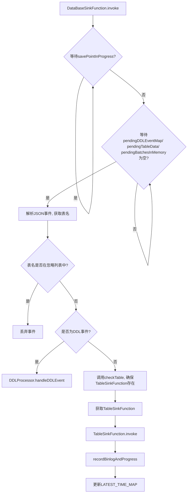

**TableSinkFunction.invoke 详细流程**:

```mermaid
graph TD
    A[TableSinkFunction.invoke] --> B[计算分区索引];
    B --> C[获取对应分区TableQueue];
    C --> D[反压检查: 队列满或全局队列满];
    D -- 满足 --> E[Thread.sleep(100)];
    E --> D;
    D -- 不满足 --> F[putBatch 将事件放入队列];
    F --> G[更新统计信息];
    G --> H[定时任务扫描队列, 提交DB-Processor处理];
```

**DB-Processor 处理逻辑**:

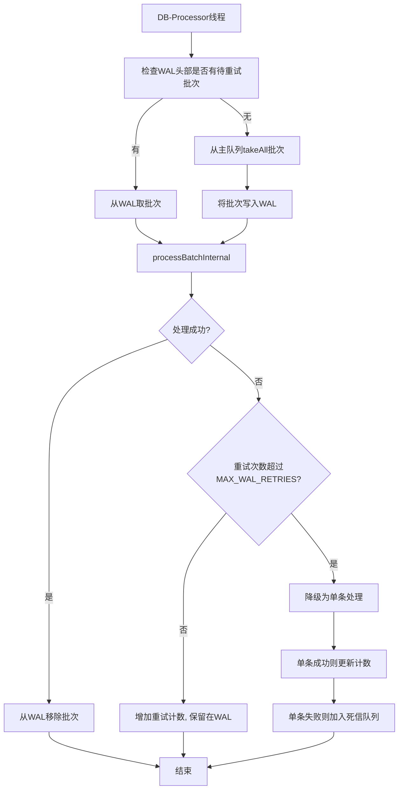

**详细业务说明**：

1. **入口**: `DataBaseSinkFunction`是Flink作业的最终Sink。`invoke()`方法首先进行一系列反压检查（如等待快照完成、DDL/失败事件处理完成）。
2. **事件分发**: 根据事件中的表名，找到对应的`TableSinkFunction`实例。
3. **分区路由**: `TableSinkFunction`根据表的主键或唯一键计算分区索引，确保同一行数据的变更进入同一队列，保证顺序性。
4. **队列缓存**: 事件被放入`TableLevelQueueManager`管理的`BlockingQueue`中。
5. **异步处理**: 定时任务（`startScheduleAtFixedRate`）扫描队列，当队列非空且无活跃处理器时，提交`DB-Processor`任务到`GroupedExecutorManager`管理的线程池。
6. **WAL机制**:
   - `DB-Processor`从队列取出数据后，会先将其写入Flink的状态（`pendingBatchesState`），形成一个“批次”。
   - 成功写入数据库后，从状态中移除该批次。
   - 若写入失败，保留在状态中，等待下次重试。
   - 若重试次数超过阈值，则降级为单条写入；若单条仍失败，则放入死信队列（`pendingFailedEvents`），由定时器持续重试。这保证了数据最终不丢失。
7. **批量写入**: `processBatchInternal`根据操作类型（快照/增删改）和是否包含删除，选择不同的批量写入策略（`executeBatchUpsert`或逐条处理）。
8. **进度更新**: 每次成功处理事件后，更新`currentBinlogPosition`和`syncProgressMap`。

### 8.3 主备切换处理流程 (`DBHAStatusTableFunction.invoke` & `DBHASwitchStatusJob`)

**流程图**：

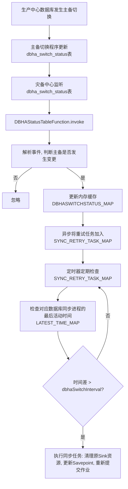

**详细业务说明**：

1. **事件源**: 生产中心主备切换后，会触发更新`dbha_switch_status`表，并通过CDC（Flink作业本身也在同步该表）同步到灾备中心。
2. **事件捕获**: 灾备中心的`DBHAStatusTableFunction`（通过`@TableSink`注解注册）会接收到该表的变更事件。
3. **异步处理**: `invoke()`方法解析事件，判断主IP是否变化。若变化，则将切换信息存入内存，并异步提交一个重试任务到`SYNC_RETRY_TASK_MAP`。
4. **延迟执行**: 定时任务`DBHASwitchStatusJob.scanSwitchStatusToDB`定期检查`SYNC_RETRY_TASK_MAP`。为避免切换瞬间频繁启停作业，会等待一段时间（`dbhaSwitchInterval`），直到对应数据库的`LATEST_TIME_MAP`中的时间戳超过阈值，才执行重启。
5. **同步重建**:
   - 清理旧的`DataBaseSinkFunction`和相关的表级算子、连接池、线程池资源。
   - 清空目标库的旧数据（可选，根据模式决定）。
   - 使用从切换事件中获取的最新binlog文件及位置，更新该数据库的`savepoint`文件（`updateSavePoint`方法）。
   - 重新调用`syncSingleDbMapping`，启动新的同步作业，该作业会从更新的`savepoint`或指定的binlog位置开始同步。

### 8.4 DDL处理流程 (`DDLProcessor.handleDDLEvent`)

**流程图**：

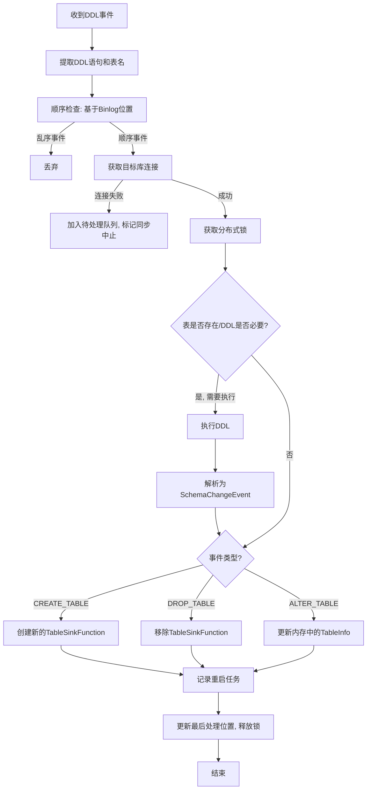

**详细业务说明**：

1. **事件识别与过滤**: `DataBaseSinkFunction`识别DDL事件，并根据`ddl-table-config.json`配置检查是否允许该表执行该类型DDL。若不允许，则跳过。
2. **顺序控制**: 通过比较DDL事件的binlog位置与`lastProcessedPosition`，确保DDL按顺序执行，避免乱序导致的状态错误。
3. **连接与锁**: 获取目标库连接，并使用基于MySQL `GET_LOCK`的分布式锁，防止多个并发DDL任务相互干扰。
4. **DDL执行**: 执行实际的DDL语句。`executeDDL`方法包含重试机制，并在连接失效时尝试重连。
5. **元数据更新**: 根据DDL类型（CREATE/ALTER/DROP），动态创建、更新或移除`TableSinkFunction`。对于CREATE TABLE，还会在`sync_restart_task`表中插入一条记录，由`RestartMonitor`负责后续的全量数据刷新（确保新表数据完整）。
6. **故障恢复**: 若DDL执行失败（如锁获取失败、连接问题），事件会被放入`pendingDDLEventMap`中，并由`DDLRetryScheduler`定时重试。

### 8.5 进度生成与Binlog备份 (`SyncProgressJob` & `SourceBinlogJob`)

**流程图 (进度生成)**：

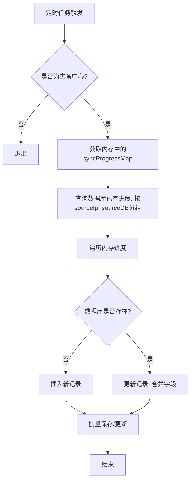

**详细业务说明**：

- **`SyncProgressJob`**: 灾备中心定时任务，将内存中的`DatabaseSyncManager.syncProgressMap`同步到数据库表`sync_progress`。同时，会根据`fullAutoToIncremental`配置，将长时间无事件的全量同步状态自动切换为同步中状态。
- **`SourceBinlogJob`**: 生产中心定时任务，通过并发执行`mysqlbinlog`命令，解析每个数据库的最新binlog文件和位置，并批量保存到`source_latest_binlog_info`表。该信息用于主备切换后，新的生产中心（原灾备）恢复同步。
- **`SourceBinlogTableFunction`**: 灾备中心的表算子，监听`source_latest_binlog_info`表的变更，并更新内存中`syncProgressMap`的`sourceBinlogFile`和`sourceBinlogTime`字段，使同步进度表展示的生产中心最新binlog信息保持最新。

### 8.6 配置加载 (`ConfigLoader`)

`ConfigLoader`负责解析`.conf`格式的配置文件，是整个系统的配置核心。

1. **解析数据库映射**: `parseDBMappingFile`逐行解析，支持`mapping[索引]`、`binlog[索引]`、`vip[索引]`、`ipMapping[索引]`等配置项。
2. **解密处理**: 遇到`encrypted_Psenstive_xxx`配置项时，先加载加密信息。在解析`mapping`行时，会调用`ShellScriptUtil.decryptMapping`对加密的value进行解密。
3. **正则解析**: 使用预编译的正则表达式（如`SINGLE_CONFIG_PATTERN`）精确匹配配置项格式，支持密码中包含`@`等特殊字符。
4. **静态存储**: 解析结果存储在`ConcurrentHashMap`中，如`DATABASE_MAPPING_MAP`（源IP -> 映射对象）、`BINLOG_POSITION_MAP`（源IP -> Binlog位置）、`VIP_MAPPING_MAP`（虚IP -> 实IP列表）等。
5. **首次同步状态管理**: 通过`global.conf`文件中的`{host}.{databaseName}.isFirstSync`键值对，记录每个数据库是否已完成首次全量同步。

---

## 9. 代码潜在问题分析与解决方案

### 9.1 分布式锁范围过大

- **问题**: `DDLProcessor`中，`lock.tryLock("ddl_lock_" + tableName, lockTimeout)` 锁的粒度是表名，但在高并发下，同一张表的多个DDL会被串行化。这是合理的，因为DDL需要顺序执行。但锁的范围是整个数据库连接，如果此连接在其他地方被复用，可能导致死锁。
- **解决方案**: 锁的范围可以更细，例如在锁内部再使用同步块对表名进行同步。目前`DDLProcessor`内部已有表级别的重试计数（`ddlRetryMap`），但这只是重试控制，不是锁。建议在`handleDDLEvent`中获取连接后，在锁内部只执行DDL和元数据更新，并将连接释放逻辑移到`finally`中。当前代码已做到。

### 9.2 线程池资源泄漏风险

- **问题**: `GroupedExecutorManager`中的`GLOBAL_MONITOR`、`DBHABSwitchStatusManager`中的`vipCheckExecutor`等线程池，虽然实现了`shutdown`方法，但需要确保在应用关闭时被调用。`DBHABSwitchStatusManager`的`@PreDestroy`已做清理，但`GroupedExecutorManager`是静态类，其`GLOBAL_MONITOR`在应用关闭时可能不会被自动关闭。
- **解决方案**: 为`GroupedExecutorManager`增加一个`shutdownAll`静态方法，并在Spring容器关闭事件（如`@PreDestroy`）中调用。目前代码中已提供`shutdownAll()`方法，但需确保被正确调用。

### 9.3 批量插入失败后数据丢失风险

- **问题**: `TableSinkFunction.executeBatchUpsert`中，如果批量插入失败（如死锁），会抛出异常并回滚事务，但当前批次的数据已经被从队列中取走。由于有WAL机制，这些数据并未丢失，它们还在`pendingBatchesState`中，等待下一次重试。这是正确的。但`executeBatchUpsert`内部如果`conn.commit()`失败，数据已提交的部分无法回滚，可能导致部分成功部分失败，破坏事务一致性。
- **解决方案**: 当前代码在`executeBatchUpsert`中使用了`conn.setAutoCommit(false)`和`stmt.executeBatch()`，但`executeBatch`是原子操作，要么全部成功，要么全部失败（抛出`BatchUpdateException`）。`conn.commit()`失败通常是由于网络问题，此时整个事务会回滚。当前处理是合理的。`executeMultiValuesInsertNew`方法中，因为需要混合删除和插入，采用了逐条提交+手动分组提交的方式，保证了每组内的操作要么全成功，要么全失败，但不同组之间可能存在不一致。这是符合业务需求的，因为删除和插入操作可能没有依赖关系。

### 9.4 配置文件的版本兼容性

- **问题**: `ConfigLoader`的正则表达式是严格匹配的。如果后续版本配置格式发生变化，可能导致解析失败，服务无法启动。
- **解决方案**: 增加配置文件的版本字段，并实现向后兼容的解析器。目前`parseSingleDatabaseConfig`中已有“智能解析”作为降级方案，但`splitDatabaseConfigs`中强依赖于`@`符号的计数，容易出错。建议优化分隔逻辑，使用更健壮的算法，如基于深度遍历。

### 9.5 `LATEST_TIME_MAP`更新不及时

- **问题**: `DataBaseSinkFunction.invoke`中，只有成功处理事件后才更新`LATEST_TIME_MAP`。如果事件被DDL、表校验、反压等流程阻塞，`LATEST_TIME_MAP`就不会更新，可能导致主备切换后，重启任务延迟执行。
- **解决方案**: 考虑在事件入队成功时就更新`LATEST_TIME_MAP`，而不是等到处理完成。因为`LATEST_TIME_MAP`的目的是记录该库是否有数据同步活动，入队成功即代表有数据流入。

---

## 10. 日志打印分析

### 10.1 日志遗漏点

1. **配置加载失败**: `ConfigLoader`解析文件失败时，只打印了错误日志，但未打印导致失败的具体配置行内容。建议在`parseMappingLine`等方法中，增加对异常配置行的详细打印。
2. **DDL执行失败**: `DDLProcessor`中，`executeDDL`方法内部有详细的失败日志，但在外部调用者（`handleDDLEvent`）中，仅捕获异常后添加到重试队列，未打印该DDL的完整内容。建议在添加重试队列前打印完整DDL。
3. **数据库连接池状态**: `DynamicShardedConnectionManager`定期打印统计信息，但未在连接获取失败时打印当前所有池的状态，不便于排查连接泄漏问题。建议在`getConnection`抛异常时，调用`getPoolStatistics()`并打印。

### 10.2 日志重复点

1. **TableSinkFunction.processBatchInternal**: 方法内对快照和CDU的处理有详细的开始和结束日志，但`executeFastBatchUpsert`中也有类似的批次处理日志。日志内容重复，建议统一入口，避免嵌套打印。
2. **BinlogInfoFetcherUtil**: `getLastBinlogForFile`方法中对每个binlog文件都打印了处理完成日志，如果文件数量很大，会产生大量INFO日志。建议改为DEBUG级别。
3. **DataBaseSinkFunction.invoke**: 在进入处理前，会循环打印等待`pendingDDLEventMap`为空的日志。在高并发等待时，该日志会每秒打印多次，占用大量磁盘。建议增加频率限制，例如每10秒打印一次。

---

## 11. 生产环境优化建议

1. **数据库连接池参数调优**: `DynamicShardedConnectionManager`中，`MAX_POOL_SIZE = 1024`，`MAX_GLOBAL_CONNECTIONS = 2000`。建议根据实际数据库服务器配置和Flink并行度进行调整，避免连接数超限。可配置化。
2. **Flink作业参数调优**: `Checkpoint`间隔和超时时间建议根据数据量和网络延迟调整，避免频繁Checkpoint导致性能下降。`parallelism`应设置为与数据量、目标库写入能力相匹配的值。
3. **监控告警增强**: `AggregatedMonitor`已提供丰富的指标，可将其接入Prometheus，并配置告警规则，如“队列大小超过阈值”、“TPS低于阈值”等。增加对`sync_restart_task`表的监控，当存在大量待处理任务时，发送告警。
4. **死信队列持久化**: `pendingFailedEvents`目前只存储在内存和Flink状态中。对于长期无法处理的失败事件，建议增加持久化到文件或外部存储的机制，便于人工介入处理。
5. **配置文件热加载**: 目前`dbMapping.conf`和`global.conf`只在启动时加载。对于IP映射等变更，需要重启服务。建议集成Nacos等配置中心，实现配置动态刷新。
6. **批量提交优化**: `TableSinkFunction`中的`commitBatchSize`目前固定。建议根据表的列数和字段类型动态调整，例如，对于有JSON/BLOB字段的表，批次大小应更小。

---

## 12. 附录

### 12.1 设计检查清单（Checklist）

| 维度       | 检查项                        | 通过  |
|:-------- |:-------------------------- |:--- |
| **架构**   | 分层清晰，依赖方向正确（高层依赖低层）        | [√] |
| **代码设计** | 类职责单一，充血模型（`TableInfo`等）明确 | [√] |
| **接口**   | 统一响应格式，参数校验完整，错误码定义清晰      | [√] |
| **数据库**  | 表有主键、创建/更新时间、索引合理，字段类型正确   | [√] |
| **非功能**  | 性能指标可测量，高可用策略明确，监控埋点完成     | [√] |
| **安全**   | 防注入、防越权、敏感数据脱敏/加密          | [√] |
| **运维**   | 健康检查端点、优雅停机、配置外置           | [√] |

### 12.2 修订记录

| 版本  | 日期         | 作者      | 变更内容                                 | 评审状态 |
|:--- |:---------- |:------- |:------------------------------------ |:---- |
| 1.0 | 2026-03-23 | [50707] | 初稿                                   | 待评审  |
| 2.0 | 2026-07-18 | [50707] | 整合全部内容，形成最终完整版，补充架构图、时序图、状态图、异常恢复流程等 | 待评审  |

---

**文档结束**
